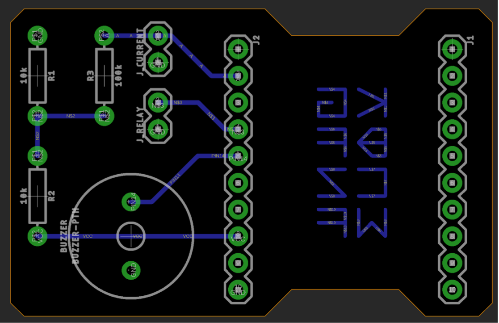

# PCB

The PCB EAGLE CAD files are included here. The PCB was milled using an Othermill (Bantam CNC) with a 1/64" tool.

The ESP8266 arduino was soldered to this PCB, along with the current sensor, powertail relay, buzzer, and some resistors.

