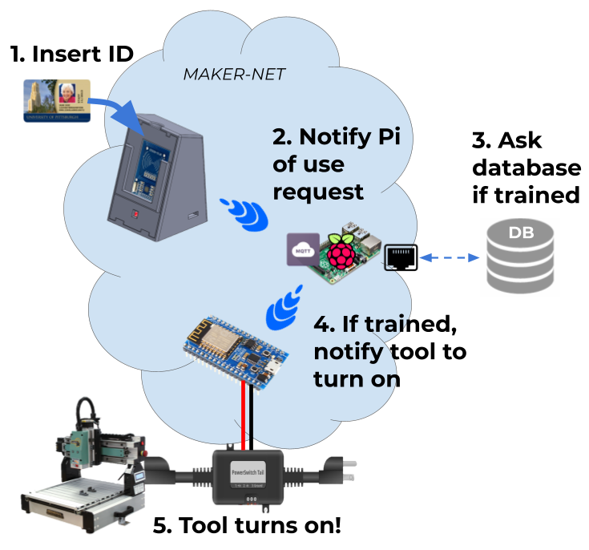

# Makerspace Lockout Project
 
Makerspace  staff  exert  much  of  their  time watching over students and verifying safety training...  a  process  that  is  mundane, imperfect, and begs for automation.Our  motivation  was  to  non-obtrusively enforce  the  safe  and  sustainable  use  of machinery  in  the  Makerspaces  across campus through RF student ID verification against a user database - if a student is not trained, power is cut to the tool and it will not turn on.

## System Usage Diagram
The system is diagrammed below. A Raspberry Pi acts as a Wi-Fi access point and MQTT broker for arduino microcontrollers in the Makerspace, and it communicates with the external database to authenticate users trying to enable tools. The complete workflow is as follows.
1. A user inserts their ID into the 3D printed "Card Holder". The Holder holds the card such that the RFID element hovers over an RFID reader. A Wi-Fi Arduino inside the Holder detects that a card has been placed and reads the UUID from the student ID.
2. The Wi-Fi Arduino publishes a MQTT message to the Raspberry Pi in the room asking for user authentication, and notifies it which tool the user is trying to use. The Arduino changes a status LED to yello to signify that authentication is underway.
3. The Pi asks the main Makerspace server if the user is authenticated for the given tool and the server responds.
4. If authenticated, the Pi publishes a MQTT message to a separate Wi-Fi Arduino that controls power to the tool via a 120V relay. The Card Holder Arduino also receives this message and changes the status LED to green to signify that the user is authenticated.
5. The Arduino enables the tool through the relay and the user can do their work. The system can detect if the tool is prematurely switched on as it turns on the relay (e.g. if the previous person forgot to turn off the tool and simply grabbed their ID and left), and quickly switches the relay off as a failsafe. A buzzer makes noise to let the user know to switch off the tool for the relay to be enabled.
6. If a user leaves their ID on a Card Reader but does not power on the machine for a certain time threshold, an email is sent to them stating that they either forgot their ID on the Card Reader or are being unsafe by leaving tools enabled and unused for long periods of time.
7. When the user is finished, they take their ID off the Card Reader, which turns the status light to red and triggers a MQTT message from the Card Reader to the Pi, which then publishes a MQTT message to the relay-controlling arduino to turn off the relay. If the user takes their ID off the reader without switching off the tool (as detected through current monitoring), a buzzer makes noise.

A buddy system is also supported in that a tool can require a room administrator to put their card in a separate "buddy" Card Holder. 

## Materials for One Connected Tool
| Component      | Quantity | Total Cost
| ----------- | ----------- | ---------
| Wi-Fi Arduino MCU (ESP8266)      | 2       | $20
| RFID Reader (MFRC522)   | 1        | $5
| RGB LED (Adafruit Neopixel)   | 1        | $1
| Relay (PowerSwitch Tail II)   | 1        | $26
| Current Sensor (30A Split Core from Sparkfun)   | 1        | $10
| Piezo Alarm (Optional)   | 1        | $3
| Power supply for MCUs | 2 | $10
| Assorted jumpers, | |
| PCB board | |
| 3D printer filament | |
| Some sort of metal lock box? | |
| | | $75

## Materials for One Connected Makerspace
| Compponent      | Quantity | Total Cost 
| ----------- | ----------- | -----
| Raspberry Pi 3      | 1       | $35
| 2A Wall Adapter Power Supply (USB Micro-B) |1 | $8
| | | $43

## State of the Repo
All arduino code has been uploaded

All EAGLE PCB CAD files have been uploaded

Most SolidWorks CAD files have been uploaded - I am missing the main body file but will keep looking for it

None of the In-Room Pi Access Point files have been uploaded - I have these stored elsewhere and will upload soon. I also will add complete SD card images that can be flashed.

The Database has been defined but the external server code has not been uplaoded - I have these stored elsewhere and will upload soon.
